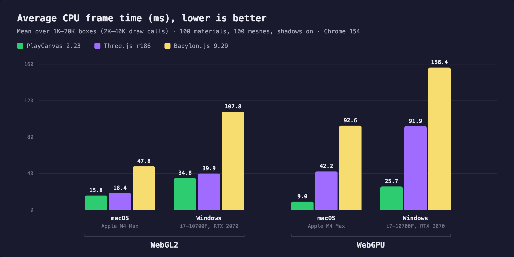
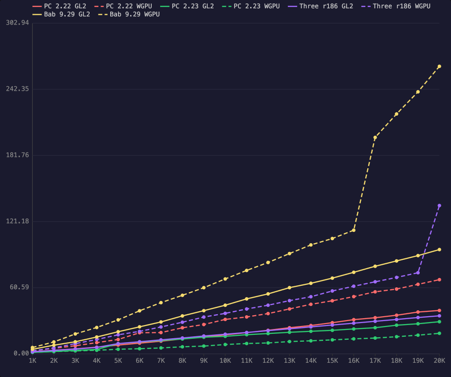
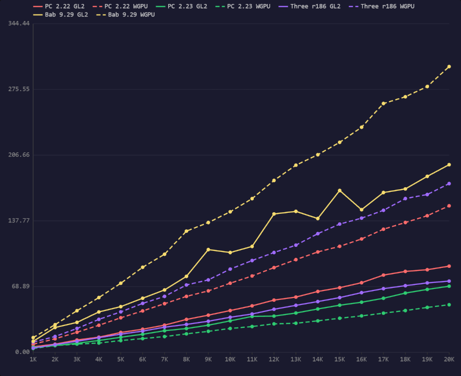

# Web Engines Compare

Benchmarks comparing [PlayCanvas](https://playcanvas.com), [Three.js](https://threejs.org)
and [Babylon.js](https://www.babylonjs.com) — across engine versions *and* graphics
backends, so optimizations can be measured release to release.

**Live:** https://mvaligursky.github.io/web-engines-compare/

Every engine version declares a build per backend (WebGL2 and WebGPU), and each
(version, backend) pair becomes a column in every test. In the charts, color identifies
the engine version and a dashed line means WebGPU.

## Tests

### Draw Call Performance (`tests/draw-calls/`)

CPU submission cost test: a dense 2D grid of small boxes (1K–20K in 1K steps), each box
its own draw call, viewed by matching perspective cameras so every engine renders the
same deterministic image. The boxes use 100 unique meshes, boxes of different
proportions with their own vertex and index buffers, in a deterministic random order,
and 100 unique materials, round-robin. One directional light casts shadows with a single
cascade (2048 map) onto a plane behind the grid: the boxes cast, the plane receives, so
every box is also drawn into the shadow map. Boxes are tiny in screen space and MSAA is
off with pixel ratio forced to 1, so GPU cost stays low and the numbers reflect
main-thread cost. (Verified, before meshes and shadows were added: shrinking the
viewport 8x moves the results by only a few percent, so the test really is CPU-bound.)

- **Unique materials** dropdown (1, 50, 100 … 1000): materials are assigned round-robin,
  so more unique materials means more state changes between draws.
- **Unique meshes** dropdown (1, 50, 100 … 1000): each box picks a mesh in a
  deterministic random order, so draws switch vertex and index buffers as they would in
  a real scene. 1 reproduces the earlier single-mesh test.
- **Shadows** dropdown — *On* (default): the directional light's single-cascade shadow
  pass is part of every frame; *Off*: the forward pass alone.
- **Material complexity** dropdown — native PBR (glTF metallic-roughness compatible)
  materials in all engines (`StandardMaterial` / `MeshStandardMaterial` /
  `PBRMetallicRoughnessMaterial`):
  - *Simple* — base color / metallic / roughness factors only
  - *Textured* — + unique base color texture per material
  - *Complex* (default) — + metallic-roughness, normal and emissive textures per material
- **Draw order** dropdown — see below.
- The grid runs each row cumulatively (build 1K, measure, add 1K more, measure, …) so a
  full column is a single engine session.

## Results

Draw Call Performance on 2026-10-01, on two machines, at the default settings: 100 unique
materials (complex), 100 unique meshes, shadows on, engine default draw order, 5 warmup +
20 measured frames per count, pixel ratio 1, MSAA off. Every box is drawn twice (forward
and shadow pass), so 20K boxes is about 40K draw calls.

| Machine | Hardware | Browser | Graphics | Viewport |
| --- | --- | --- | --- | --- |
| macOS | Apple M4 Max | Chrome 154 | WebGL2 through ANGLE on Metal, WebGPU on Metal | 1261x899 |
| Windows | Intel Core i7-10700F 2.9 GHz, NVIDIA GeForce RTX 2070 | Chrome 154 | WebGL2 through ANGLE on Direct3D 11, WebGPU | 2022x1143 |

| Columns | Engine version | Build |
| --- | --- | --- |
| PC 2.22 | PlayCanvas 2.22.6 | `playcanvas@2.22.6/build/playcanvas.mjs` |
| PC 2.23 | PlayCanvas 2.23.0 | `playcanvas@2.23.0/build/playcanvas.mjs` |
| Three r186 | Three.js 0.186.1 | `three@0.186.1/build/three.module.js` (WebGL2), `three.webgpu.js` (WebGPU) |
| Babylon 9.29 | Babylon.js 9.29.0 | `babylonjs@9.29.0/babylon.js` |

### Overview

The latest version of each engine, per graphics backend and machine.



Average CPU frame time (ms), lower is better: the mean frame time averaged over the 20 box
counts, 1K to 20K.

| Engine | macOS WebGL2 | macOS WebGPU | Windows WebGL2 | Windows WebGPU |
| --- | ---: | ---: | ---: | ---: |
| PlayCanvas 2.23.0 | 15.76 | 9.00 | 34.79 | 25.74 |
| Three.js r186 | 18.44 | 42.24 | 39.85 | 91.87 |
| Babylon.js 9.29 | 47.82 | 92.56 | 107.79 | 156.36 |

The columns keep each engine's own draw order, so cross-engine numbers are not
like-for-like (see [Draw order](#draw-order)).

### macOS, Apple M4 Max



CPU frame time, mean (ms), lower is better.

| Boxes | PC 2.22 WebGL2 | PC 2.22 WebGPU | PC 2.23 WebGL2 | PC 2.23 WebGPU | Three r186 WebGL2 | Three r186 WebGPU | Babylon 9.29 WebGL2 | Babylon 9.29 WebGPU |
| --- | ---: | ---: | ---: | ---: | ---: | ---: | ---: | ---: |
| 1K | 1.89 | 2.77 | 1.33 | 1.25 | 1.76 | 2.75 | 4.14 | 5.75 |
| 2K | 3.21 | 5.07 | 2.03 | 2.00 | 3.11 | 5.42 | 7.87 | 10.86 |
| 3K | 4.50 | 7.36 | 3.14 | 2.66 | 4.35 | 9.33 | 11.02 | 18.19 |
| 4K | 6.05 | 10.23 | 3.99 | 3.24 | 5.81 | 13.09 | 15.35 | 24.09 |
| 5K | 8.02 | 13.11 | 9.28 | 4.17 | 9.32 | 17.40 | 20.22 | 31.08 |
| 6K | 9.75 | 19.29 | 10.85 | 4.64 | 11.03 | 20.53 | 24.69 | 39.39 |
| 7K | 11.54 | 19.44 | 12.17 | 5.36 | 12.73 | 24.58 | 29.18 | 46.87 |
| 8K | 13.65 | 23.83 | 13.56 | 6.41 | 14.46 | 28.92 | 34.71 | 53.60 |
| 9K | 15.22 | 26.83 | 15.19 | 7.06 | 16.28 | 33.66 | 39.52 | 60.57 |
| 10K | 17.38 | 31.51 | 16.01 | 8.50 | 17.90 | 37.04 | 44.50 | 68.58 |
| 11K | 19.39 | 33.75 | 17.49 | 9.42 | 19.51 | 41.05 | 50.32 | 76.39 |
| 12K | 21.51 | 36.83 | 18.55 | 9.94 | 21.23 | 44.51 | 54.90 | 83.68 |
| 13K | 23.89 | 41.10 | 19.71 | 11.21 | 22.90 | 48.71 | 60.60 | 91.84 |
| 14K | 25.90 | 45.35 | 20.63 | 11.89 | 24.64 | 52.30 | 64.60 | 99.79 |
| 15K | 28.50 | 48.58 | 21.52 | 12.75 | 26.36 | 57.58 | 69.34 | 105.63 |
| 16K | 31.29 | 52.39 | 22.76 | 13.67 | 28.05 | 61.90 | 74.67 | 113.24 |
| 17K | 33.04 | 56.78 | 23.88 | 14.43 | 29.78 | 65.97 | 80.21 | 198.29 |
| 18K | 35.32 | 59.33 | 26.20 | 15.64 | 31.45 | 69.96 | 85.09 | 219.79 |
| 19K | 38.27 | 63.65 | 27.51 | 17.06 | 33.23 | 74.29 | 89.98 | 240.08 |
| 20K | 39.70 | 67.93 | 29.41 | 18.75 | 34.81 | 135.86 | 95.50 | 263.43 |

- PlayCanvas 2.23.0 against 2.22.6 at 20K boxes: 1.35x faster on WebGL2 (39.70 to
  29.41 ms) and 3.62x faster on WebGPU (67.93 to 18.75 ms).
- Full export, with median and min frame time and the draw calls each engine submitted:
  [`results/draw-calls-2026-10-01-macos.txt`](results/draw-calls-2026-10-01-macos.txt).

### Windows, Intel Core i7-10700F, NVIDIA GeForce RTX 2070



CPU frame time, mean (ms), lower is better.

| Boxes | PC 2.22 WebGL2 | PC 2.22 WebGPU | PC 2.23 WebGL2 | PC 2.23 WebGPU | Three r186 WebGL2 | Three r186 WebGPU | Babylon 9.29 WebGL2 | Babylon 9.29 WebGPU |
| --- | ---: | ---: | ---: | ---: | ---: | ---: | ---: | ---: |
| 1K | 5.76 | 8.49 | 5.20 | 4.01 | 4.48 | 10.65 | 11.52 | 15.43 |
| 2K | 8.53 | 14.16 | 7.06 | 7.08 | 8.08 | 16.57 | 26.01 | 28.97 |
| 3K | 12.89 | 21.02 | 9.48 | 8.61 | 11.59 | 24.99 | 31.35 | 43.61 |
| 4K | 15.89 | 28.34 | 12.38 | 9.69 | 15.31 | 34.52 | 42.31 | 57.39 |
| 5K | 20.80 | 36.20 | 15.79 | 12.31 | 19.04 | 42.39 | 47.87 | 72.37 |
| 6K | 24.21 | 43.37 | 18.93 | 14.38 | 22.21 | 51.26 | 56.66 | 89.12 |
| 7K | 28.46 | 51.00 | 22.63 | 16.50 | 26.33 | 58.60 | 65.39 | 102.77 |
| 8K | 34.46 | 58.61 | 24.94 | 19.33 | 29.25 | 70.61 | 79.59 | 127.01 |
| 9K | 38.94 | 64.39 | 28.42 | 21.99 | 32.57 | 75.91 | 107.66 | 136.04 |
| 10K | 43.77 | 72.42 | 32.95 | 24.97 | 36.74 | 87.20 | 104.60 | 147.28 |
| 11K | 48.70 | 80.01 | 37.63 | 27.01 | 40.14 | 96.20 | 110.97 | 161.08 |
| 12K | 54.72 | 88.78 | 37.94 | 29.84 | 45.11 | 104.60 | 145.03 | 180.17 |
| 13K | 57.88 | 97.15 | 41.19 | 30.44 | 49.23 | 112.30 | 147.71 | 196.14 |
| 14K | 63.76 | 105.19 | 45.42 | 32.96 | 53.18 | 124.36 | 140.23 | 207.12 |
| 15K | 67.74 | 111.07 | 49.36 | 35.71 | 57.33 | 134.41 | 169.60 | 220.10 |
| 16K | 72.95 | 118.81 | 52.50 | 38.16 | 62.55 | 140.60 | 149.49 | 235.91 |
| 17K | 80.93 | 129.01 | 56.64 | 41.04 | 66.71 | 148.82 | 167.47 | 260.79 |
| 18K | 84.79 | 136.07 | 62.10 | 43.77 | 69.84 | 161.16 | 171.27 | 267.85 |
| 19K | 86.57 | 143.16 | 65.91 | 47.04 | 72.75 | 165.37 | 184.41 | 278.55 |
| 20K | 90.31 | 153.58 | 69.29 | 49.86 | 74.62 | 176.82 | 196.68 | 299.51 |

- PlayCanvas 2.23.0 against 2.22.6 at 20K boxes: 1.30x faster on WebGL2 (90.31 to
  69.29 ms) and 3.08x faster on WebGPU (153.58 to 49.86 ms).
- Full export, with median and min frame time and the draw calls each engine submitted:
  [`results/draw-calls-2026-10-01-windows.txt`](results/draw-calls-2026-10-01-windows.txt).

## Draw order

The default is **engine default** order: nothing is overridden and every engine sorts
opaque draws however it normally would. That is what a real application gets, so it is the
representative case for tracking one engine across versions.

The trade-off is that, left to themselves, these engines reorder opaque draws and **do not
agree on the criteria**. Five of the six columns group draws by material — which collapses
the per-draw material binds — while three.js on WebGPU sorts by depth and does not group,
so it performs ~100x more material rebinds than its neighbours. That divergence is real
engine behaviour and is never overridden, but it does leave the columns incomparable
across engines.

Creation order is there for that comparison: every engine and backend submits in exactly
the same grid order, the material changes on nearly every draw, and the raw per-draw cost
is isolated.

| Engine | Default opaque sort | Groups by material? |
| --- | --- | --- |
| PlayCanvas (both) | `SORTMODE_MATERIALMESH` on `MeshInstance._sortKeyForward` (packs `material.id`) | yes |
| Three.js WebGL2 | `painterSortStable`: groupOrder → renderOrder → `material.id` → variant → z → id | yes |
| Three.js WebGPU | a *different* `painterSortStable`: groupOrder → renderOrder → **z** → id | **no** |
| Babylon.js (both) | `RenderingGroup.PainterSortCompare` = `material.uniqueId` difference | yes |

The two modes:

- **Engine default** (default) — nothing overridden; every engine sorts however it
  normally would (the table above). What an application actually gets, but the columns are
  not submitting in the same order, so cross-engine numbers are not like-for-like.
- **Creation order** — cubes submitted in grid order, so the material changes on nearly
  every draw. Same submission order in every engine and backend, isolating raw per-draw
  cost.

Only creation order is forced, and here is how, per engine:

| Engine | Forcing creation order |
| --- | --- |
| PlayCanvas | `layer.opaqueSortMode = SORTMODE_NONE` — skips the sort, submits in MeshInstance insertion order |
| Three.js | `renderer.sortObjects = false` — skips the sort *and* the per-object depth projection (both backends) |
| Babylon.js | `scene.setRenderingOrder(0, byUniqueId)` — Babylon has **no** unsorted opaque path, so an explicit comparator is required |

Verified at two independent levels: each engine's own submission order (material switches
come out at 99 grouped vs 1999 forced, for 2000 cubes / 100 materials) and GPU-API state
churn on WebGL (texture rebinds per frame, 100 vs 2000).

## What is measured

**CPU frame time (ms)** — the mean main-thread time the engine spends per frame, over 20
measured frames after 5 warmup frames (plus 8 discarded settle frames).

This is the engine's **whole per-frame CPU cost**, not just the draw-submission part. It
includes world-matrix updates, frustum culling, render-list build and sort, material and
uniform binding, and draw submission. It excludes GPU execution and vsync idle, because
all three engines return before the GPU has finished the frame — so a GPU-bound scene
would *not* show up here (which is why the scene is deliberately GPU-light).

Where the timer sits in each engine:

| Engine | Measured window | Covers |
| --- | --- | --- |
| Three.js | around `renderer.render()` | matrix update, culling, sort, submission (three has no separate update step) |
| Babylon.js | around `beginFrame()` + `scene.render()` + `endFrame()` | matrix update, active-mesh evaluation, sort, submission |
| PlayCanvas | between the `frameupdate` and `frameend` app events | `app.update()` (component systems) + `app.render()` |

The `.txt` export also records median and min CPU frame time, and the number of draw
calls each engine actually submitted. That last one is a correctness guard: if a renderer
submits fewer draws than expected — one per box, two with shadows (e.g. WebGPU pipelines
still compiling) — a warning appears on the page and that row is flagged as not
comparable.

## Measurement isolation

**One engine is alive at a time.** Each column runs in its own iframe
(`bench-frame.html` + [`lib/column-run.js`](lib/column-run.js)), created and destroyed
around that column, so peak memory is the largest *single* scene rather than the sum —
adding engine versions costs nothing.

### The warm-up phase

Every run first **starts and shuts down every enabled engine once** with a small scene
(1000 boxes, 8 materials, 8 meshes, 3 frames) before measuring anything.

This is needed because measured cost attaches to a graphics context's **ordinal position
in the renderer process**, not to measurement order. Proved with two byte-identical
PlayCanvas builds served from different CDNs, where the true ratio is exactly 1.0:

| Creation order | A (jsdelivr) | B (unpkg) | Slower |
| --- | --- | --- | --- |
| A then B | 9.91 ms | 10.14 ms | B — created second |
| B then A | 10.63 ms | 9.44 ms | A — created second |

The shape of that penalty, for one column at a fixed workload:

| Ordinal | #1 | #2 | #3 | #4 | #5 | #7 | #9 |
| --- | --- | --- | --- | --- | --- | --- | --- |
| ms | 8.88 | 10.78 | 9.92 | 9.90 | 9.61 | 10.14 | 10.25 |

The first context is ~11% fast, the second ~11% slow, then it plateaus. Nothing else clears
it: not a per-column iframe, not a page reload (programmatic *or* the browser button), not
a 30 s cooldown — only a fresh browser process. Bare WebGL/WebGPU contexts advance the
ordinal only ~40%, so they are not a substitute for real engine sessions.

Warming every engine puts all measurements past the anomalous positions, and no engine
benefits from having gone first. The warm-up set is always *all* enabled columns whatever
subset you measure, so a single-column run stays comparable with a full run.

**Verified** by a null test — the same column measured first vs second in the same page,
3 paired reps: **-1.0%** (-2.4%, -1.1%, +0.5%), down from 14.4-14.8% before the warm-up.

### Cost

| | |
| --- | --- |
| Full 8-column x 20-row matrix (1K-20K, complex, 100 meshes, shadows) | ~245 s |
| Full matrix before meshes and shadows were added | ~184 s, peak 720 MB |
| Single light column to 20K (incl. warm-up) | ~7 s, peak 148-196 MB |
| Single Babylon WebGPU column to 20K | ~15 s, peak 471 MB |

Peak is set by the heaviest column plus teardown lag, not by how many columns you run.
Per-cube scene cost at 20K differs a lot by engine — Babylon ~17-22 KB, PlayCanvas
~5-6 KB, three ~3-6 KB — so Babylon is what puts a run near the limit. On memory-tight
devices, lower the cube range or skip the Babylon columns (they are individually runnable
from their column headers).

For a definitive few-percent version comparison, still prefer one column per browser
launch: only a fresh browser process fully resets the ordinal effect.

## Engine versions

The PlayCanvas columns are the current release (2.23.0) and the previous one
(2.22.6), next to Three.js r186 and Babylon.js 9.29.

### Measuring a local PlayCanvas branch

[`engines.config.js`](engines.config.js) also has a `PC local` entry, which loads
`local-builds/playcanvas-local.mjs` — the engine branch you are optimizing. It is
disabled with `enabled: false`, since the build is not committed and so is not on the
live site. To measure a branch, build it into that file (see
[`local-builds/README.md`](local-builds/README.md)) and set `enabled: true` locally.

### Adding an engine version

Edit [`engines.config.js`](engines.config.js) and add an entry:

```js
{
    id: 'playcanvas-2.24.0-dev',
    engine: 'playcanvas',
    label: 'PlayCanvas 2.24 dev',
    shortLabel: 'PC 2.24d',
    builds: {
        webgl2: { kind: 'esm', url: './local-builds/playcanvas-2.24.0-dev.mjs' },
        webgpu: { kind: 'esm', url: './local-builds/playcanvas-2.24.0-dev.mjs' }
    }
}
```

- Published versions: point `url` at a CDN (jsdelivr/unpkg).
- Custom/unreleased builds: copy a single-file build into `local-builds/` and use a
  relative url as above (for PlayCanvas: `npm run build` then copy
  `build/playcanvas.mjs`).
- `kind: 'script'` with a `global` field loads UMD builds (used for Babylon).
- `enabled: false` leaves the entry out of every test.
- Omit a backend to skip it for that version — no column is created. Columns for a
  backend the *browser* lacks are shown as `n/a` rather than failing the run.

## Running locally

Static site, no build step. Serve the repo root with any web server that does not let
the browser cache the ES modules, or edits will not show up on reload:

```
npx http-server -c-1 -p 8080 .
```

Dev-only URL params for quick iterations (defaults are the real benchmark):
`?rows=500,1000&warmup=2&measure=10&mats=1000&meshes=1&complexity=complex&order=creation&shadows=off`

`scene-viewer.html` renders the shared scene with a single engine, for checking visual
parity: `scene-viewer.html?engine=three&backend=webgpu&count=2000&materials=100&meshes=100&complexity=complex&shadows=on`

## Methodology notes

- Scene, camera, light and materials are defined once in engine-agnostic form
  ([`lib/scene-spec.js`](lib/scene-spec.js)) and instantiated by thin per-engine
  adapters ([`adapters/`](adapters)); everything is deterministic (seeded PRNG).
- Color parity is handled per engine: the spec's colors are sRGB, which PlayCanvas takes
  as-is, three needs `Color.setRGB(..., SRGBColorSpace)` (its numeric constructor is
  linear), and Babylon's PBR factors need `.toLinearSpace()`. Light intensities are tuned
  per engine so measured on-screen brightness matches within a few percent.
- One directional light, no IBL, no ambient in every engine. Its shadows use one
  cascade in every engine: PlayCanvas `numCascades: 1` covering the view up to the plane,
  three's single orthographic shadow camera sized to the plane, and Babylon's
  `ShadowGenerator`, which fits its shadow map to the casters every frame. All three
  filter with PCF.
- Adapters assert they got the backend they asked for — all three engines can silently
  fall back to WebGL, which would make a "WebGPU" column a second WebGL run.
- Each column creates a fresh canvas + context and is torn down afterwards; a short pause
  between columns lets the browser reclaim GPU memory.
- Engines keep their default per-frame behavior (culling, transform management) —
  that is part of what is being compared. Nothing is frozen or instanced.
