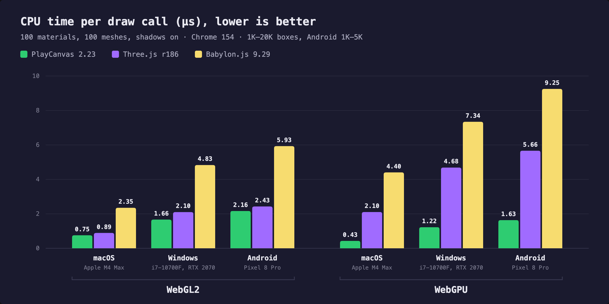
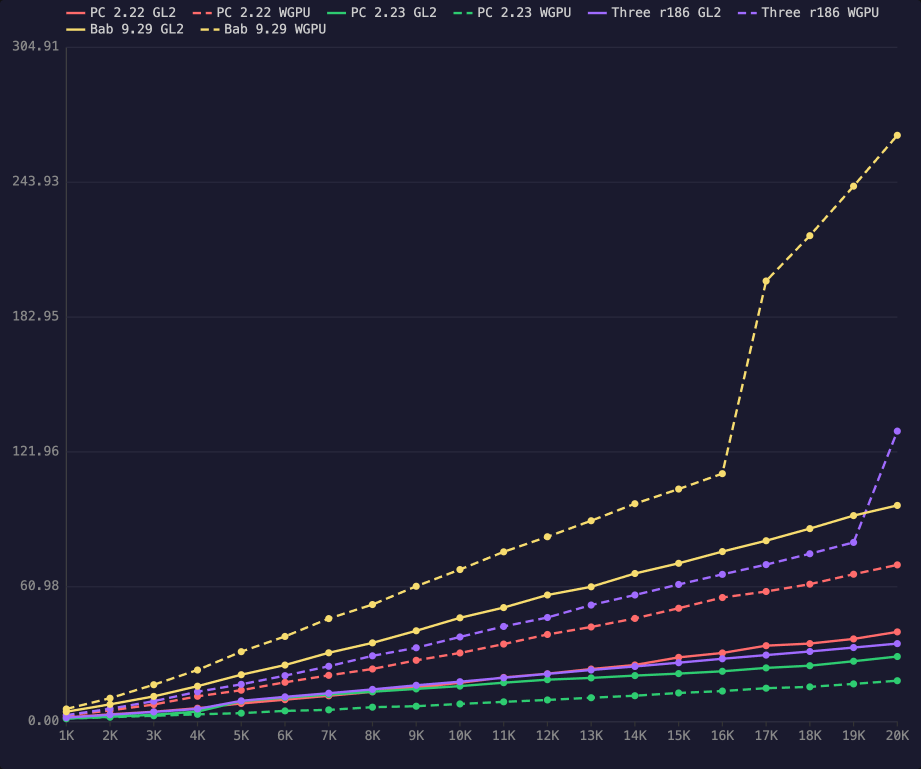
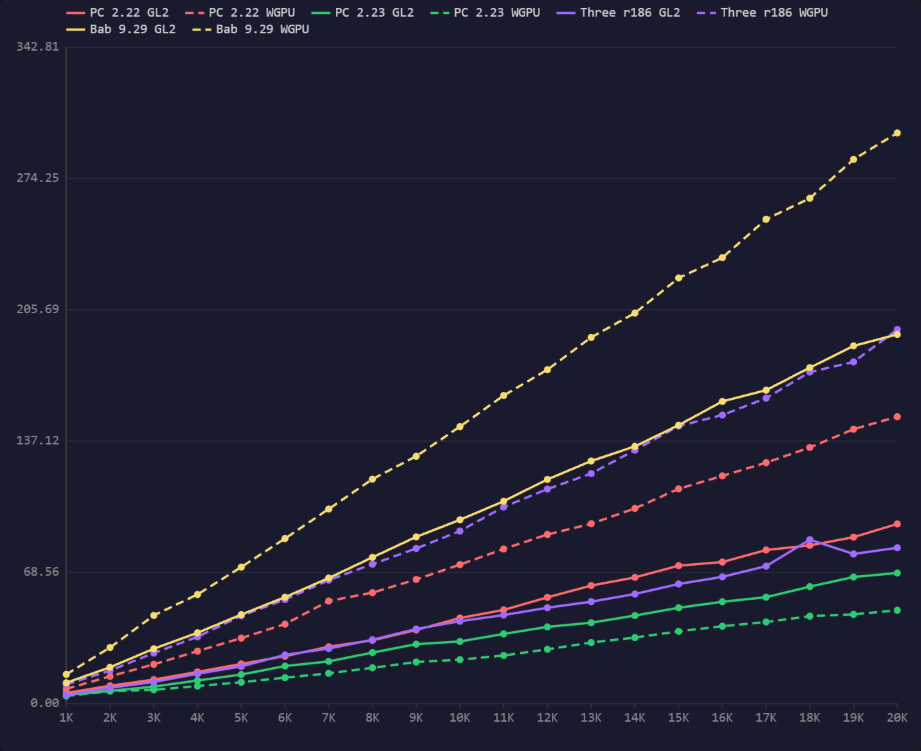
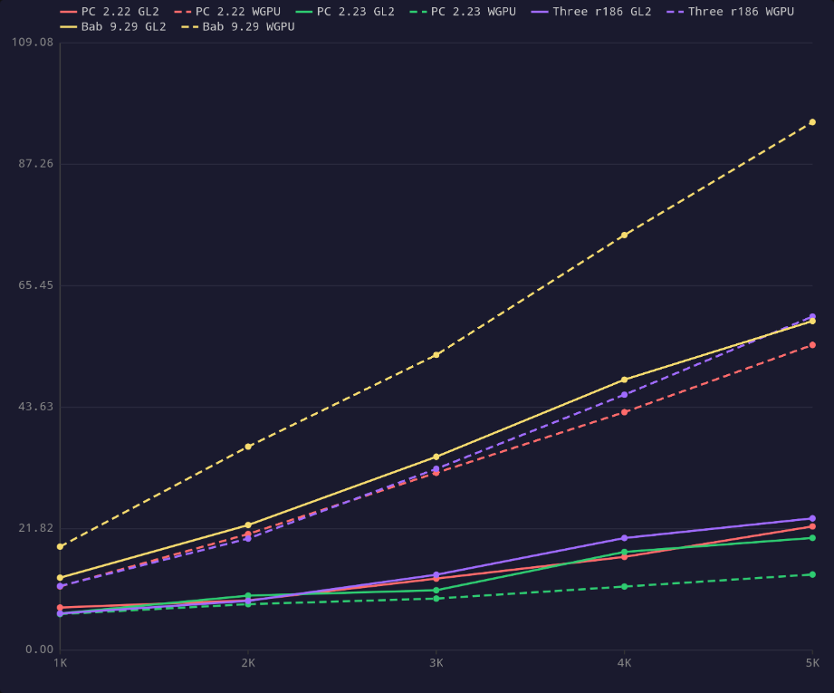

# Draw Call Performance results, 2026-10-01

[Back to the README](../../README.md)

The [Draw Call Performance](../../README.md#draw-call-performance-testsdraw-calls) test on three
devices, at the default settings: 100 unique materials (complex), 100 unique meshes, shadows
on, engine default draw order, 5 warmup + 20 measured frames per count, pixel ratio 1, MSAA
off. Every box is drawn twice (forward and shadow pass), so 20K boxes is about 40K draw calls.
Every column groups opaque draws by material (see [Draw order](../../README.md#draw-order)).

| Device | Hardware | Browser | Graphics | Viewport | Boxes |
| --- | --- | --- | --- | --- | --- |
| macOS | Apple M4 Max | Chrome 154 | WebGL2 through ANGLE on Metal, WebGPU on Metal | 1261x899 | 1K–20K |
| Windows | Intel Core i7-10700F 2.9 GHz, NVIDIA GeForce RTX 2070 | Chrome 154 | WebGL2 through ANGLE on Direct3D 11, WebGPU | 2022x1143 | 1K–20K |
| Android | Google Pixel 8 Pro (Tensor G3, Arm Mali-G715) | Chrome 154 | WebGL2 through ANGLE on OpenGL ES 3.2, WebGPU | 1792x3468 | 1K–5K, to avoid thermal throttling |

| Columns | Engine version | Build |
| --- | --- | --- |
| PC 2.22 | PlayCanvas 2.22.6 | `playcanvas@2.22.6/build/playcanvas.mjs` |
| PC 2.23 | PlayCanvas 2.23.0 | `playcanvas@2.23.0/build/playcanvas.mjs` |
| Three r186 | Three.js 0.186.1 | `three@0.186.1/build/three.module.js` (WebGL2), `three.webgpu.js` (WebGPU) |
| Babylon 9.29 | Babylon.js 9.29.0 | `babylonjs@9.29.0/babylon.js` |

## Overview

The latest version of each engine on each device and graphics backend.

CPU time per draw call (µs), lower is better: each engine's mean frame times summed over all
measured box counts, divided by the draw calls it submitted at those counts. Per draw call, so the devices compare despite Android's shorter range.

| Engine | macOS WebGL2 | macOS WebGPU | Windows WebGL2 | Windows WebGPU | Android WebGL2 | Android WebGPU |
| --- | ---: | ---: | ---: | ---: | ---: | ---: |
| PlayCanvas 2.23.0 | 0.75 | 0.43 | 1.66 | 1.22 | 2.16 | 1.63 |
| Three.js r186 | 0.89 | 2.10 | 2.10 | 4.68 | 2.43 | 5.66 |
| Babylon.js 9.29 | 2.35 | 4.40 | 4.83 | 7.34 | 5.93 | 9.25 |

## macOS, Apple M4 Max

CPU frame time, mean (ms), lower is better.

| Boxes | PC 2.22 WebGL2 | PC 2.22 WebGPU | PC 2.23 WebGL2 | PC 2.23 WebGPU | Three r186 WebGL2 | Three r186 WebGPU | Babylon 9.29 WebGL2 | Babylon 9.29 WebGPU |
| --- | ---: | ---: | ---: | ---: | ---: | ---: | ---: | ---: |
| 1K | 1.94 | 2.81 | 1.41 | 1.32 | 1.81 | 2.94 | 4.48 | 5.73 |
| 2K | 3.31 | 5.05 | 2.19 | 2.01 | 3.13 | 5.82 | 7.82 | 10.60 |
| 3K | 4.49 | 7.75 | 3.12 | 2.67 | 4.40 | 9.25 | 11.42 | 16.71 |
| 4K | 6.08 | 11.46 | 4.53 | 3.31 | 5.74 | 13.52 | 16.04 | 23.35 |
| 5K | 8.21 | 14.21 | 9.26 | 3.85 | 9.41 | 16.86 | 21.23 | 31.65 |
| 6K | 9.93 | 17.80 | 10.86 | 4.87 | 11.21 | 20.81 | 25.59 | 38.53 |
| 7K | 11.69 | 20.94 | 12.24 | 5.33 | 12.86 | 25.03 | 31.13 | 46.60 |
| 8K | 13.46 | 23.82 | 13.53 | 6.55 | 14.59 | 29.76 | 35.62 | 52.95 |
| 9K | 15.46 | 27.73 | 14.80 | 6.98 | 16.44 | 33.40 | 41.09 | 61.22 |
| 10K | 17.58 | 31.06 | 16.07 | 8.01 | 18.07 | 38.30 | 46.95 | 68.77 |
| 11K | 19.99 | 35.08 | 17.62 | 8.95 | 19.84 | 43.05 | 51.58 | 76.78 |
| 12K | 21.68 | 39.42 | 18.98 | 9.81 | 21.59 | 47.09 | 57.27 | 83.61 |
| 13K | 23.79 | 42.81 | 19.79 | 10.81 | 23.36 | 52.72 | 60.98 | 90.85 |
| 14K | 25.63 | 46.68 | 20.82 | 11.73 | 24.96 | 57.27 | 66.99 | 98.55 |
| 15K | 29.06 | 51.28 | 21.73 | 12.97 | 26.65 | 62.04 | 71.60 | 105.18 |
| 16K | 31.06 | 56.13 | 22.77 | 13.83 | 28.44 | 66.60 | 76.90 | 112.15 |
| 17K | 34.35 | 58.85 | 24.31 | 15.13 | 30.10 | 71.01 | 81.81 | 199.25 |
| 18K | 35.31 | 62.17 | 25.30 | 15.72 | 31.72 | 75.92 | 87.29 | 219.76 |
| 19K | 37.41 | 66.66 | 27.32 | 17.07 | 33.51 | 81.05 | 93.17 | 242.14 |
| 20K | 40.58 | 70.89 | 29.45 | 18.51 | 35.29 | 131.38 | 97.77 | 265.14 |

PlayCanvas 2.23.0 against 2.22.6 at 20K boxes: 1.38x faster on WebGL2 (40.58 to 29.45 ms)
and 3.83x faster on WebGPU (70.89 to 18.51 ms).

Full export, with median and min frame time and the draw calls each engine submitted:
[`macos.txt`](macos.txt).

## Windows, Intel Core i7-10700F, NVIDIA GeForce RTX 2070

CPU frame time, mean (ms), lower is better.

| Boxes | PC 2.22 WebGL2 | PC 2.22 WebGPU | PC 2.23 WebGL2 | PC 2.23 WebGPU | Three r186 WebGL2 | Three r186 WebGPU | Babylon 9.29 WebGL2 | Babylon 9.29 WebGPU |
| --- | ---: | ---: | ---: | ---: | ---: | ---: | ---: | ---: |
| 1K | 5.60 | 7.75 | 4.58 | 4.00 | 4.41 | 10.03 | 10.91 | 15.31 |
| 2K | 9.35 | 14.26 | 6.63 | 6.56 | 8.26 | 17.28 | 19.01 | 29.30 |
| 3K | 12.56 | 20.54 | 8.93 | 7.25 | 11.32 | 26.44 | 28.69 | 46.09 |
| 4K | 16.59 | 27.44 | 12.09 | 9.20 | 15.61 | 34.94 | 37.03 | 57.03 |
| 5K | 20.77 | 34.24 | 15.20 | 11.18 | 19.46 | 45.91 | 46.52 | 71.34 |
| 6K | 24.82 | 41.55 | 19.64 | 13.59 | 25.49 | 54.39 | 55.62 | 86.24 |
| 7K | 29.75 | 53.63 | 22.07 | 15.84 | 28.80 | 64.51 | 65.61 | 101.67 |
| 8K | 33.10 | 57.98 | 26.67 | 18.74 | 33.41 | 72.87 | 76.43 | 117.28 |
| 9K | 38.48 | 64.88 | 31.10 | 21.75 | 39.00 | 81.06 | 87.12 | 129.23 |
| 10K | 44.74 | 72.63 | 32.49 | 23.00 | 43.07 | 90.18 | 96.03 | 144.70 |
| 11K | 48.96 | 80.81 | 36.44 | 25.17 | 46.29 | 102.73 | 105.71 | 160.96 |
| 12K | 55.52 | 88.37 | 40.11 | 28.38 | 50.12 | 112.10 | 117.10 | 174.44 |
| 13K | 61.68 | 93.97 | 42.30 | 31.94 | 53.26 | 120.18 | 126.75 | 191.31 |
| 14K | 65.94 | 101.98 | 46.04 | 34.53 | 57.26 | 132.43 | 134.38 | 204.02 |
| 15K | 72.08 | 112.24 | 50.09 | 37.78 | 62.52 | 145.00 | 145.46 | 222.31 |
| 16K | 73.97 | 118.97 | 53.23 | 40.47 | 66.24 | 150.76 | 157.87 | 232.95 |
| 17K | 80.26 | 125.87 | 55.62 | 42.66 | 71.84 | 159.56 | 163.73 | 253.00 |
| 18K | 82.67 | 133.81 | 61.13 | 45.70 | 85.67 | 173.20 | 175.52 | 263.98 |
| 19K | 86.97 | 143.36 | 66.16 | 46.65 | 78.19 | 178.50 | 186.87 | 284.29 |
| 20K | 93.87 | 149.89 | 68.27 | 48.79 | 81.44 | 195.43 | 192.88 | 298.09 |

PlayCanvas 2.23.0 against 2.22.6 at 20K boxes: 1.37x faster on WebGL2 (93.87 to 68.27 ms)
and 3.07x faster on WebGPU (149.89 to 48.79 ms).

Full export, with median and min frame time and the draw calls each engine submitted:
[`windows.txt`](windows.txt).

## Android, Google Pixel 8 Pro

Measured up to 5K boxes only, to avoid thermal throttling.

CPU frame time, mean (ms), lower is better.

| Boxes | PC 2.22 WebGL2 | PC 2.22 WebGPU | PC 2.23 WebGL2 | PC 2.23 WebGPU | Three r186 WebGL2 | Three r186 WebGPU | Babylon 9.29 WebGL2 | Babylon 9.29 WebGPU |
| --- | ---: | ---: | ---: | ---: | ---: | ---: | ---: | ---: |
| 1K | 7.65 | 11.43 | 6.59 | 6.47 | 6.58 | 11.51 | 13.00 | 18.58 |
| 2K | 8.93 | 20.86 | 9.78 | 8.25 | 8.84 | 20.04 | 22.47 | 36.56 |
| 3K | 12.84 | 31.85 | 10.75 | 9.26 | 13.54 | 32.56 | 34.73 | 53.02 |
| 4K | 16.74 | 42.74 | 17.64 | 11.41 | 20.14 | 45.88 | 48.59 | 74.56 |
| 5K | 22.22 | 54.82 | 20.15 | 13.58 | 23.66 | 59.92 | 59.11 | 94.85 |

PlayCanvas 2.23.0 against 2.22.6 at 5K boxes: 1.10x faster on WebGL2 (22.22 to 20.15 ms)
and 4.04x faster on WebGPU (54.82 to 13.58 ms).

Full export, with median and min frame time and the draw calls each engine submitted:
[`android.txt`](android.txt).
